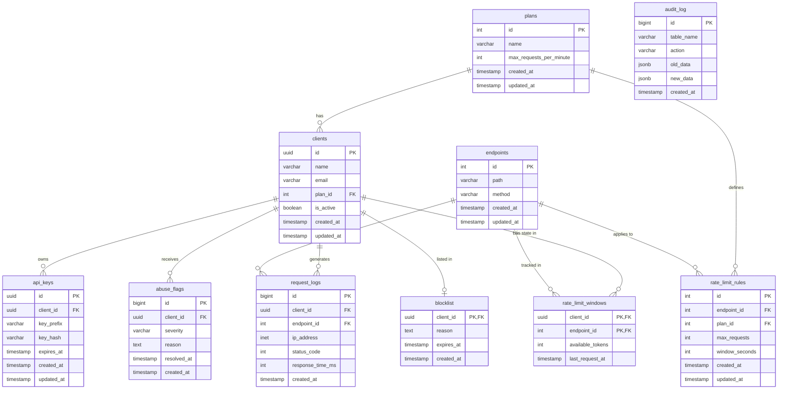

# Entity Relationship Diagram

## Table Descriptions

- **plans**: Defines subscription tiers (e.g., Free, Pro, Enterprise) and the global `max_requests_per_minute` limit.
- **clients**: Stores customer data and links them to a specific plan. Includes an `is_active` toggle to quickly disable accounts.
- **api_keys**: Stores securely hashed API keys for authentication. Uses `key_prefix` for fast lookups and partial display, while `key_hash` is matched via `pgcrypto`.
- **endpoints**: Catalog of API routes and HTTP methods available in the system. Used to apply granular limits.
- **rate_limit_rules**: Maps specific limits to combinations of endpoints and plans. Defines the token bucket capacity (`max_requests`) and refill rate (`window_seconds`).
- **request_logs**: High-volume partitioned table tracking every API call. Used for analytics, audit, and async abuse detection.
- **rate_limit_windows**: Tracks the current token bucket state for every client-endpoint pair. Optimized for high concurrency updates.
- **abuse_flags**: Records instances of anomalous behavior detected by triggers or background workers.
- **blocklist**: Authoritative list of clients explicitly denied access, either manually or via automated critical abuse flags.
- **audit_log**: Captures historical changes to critical tables (like configuration or blocklist) for compliance and debugging.

## Key Design Decisions

1. **Why token bucket over fixed window**  
   Token bucket allows for bursting and smooths out traffic spikes, whereas a fixed window can allow 2x the limit if requests straddle the window boundary. Token bucket is updated dynamically via timestamp math on every request.

2. **Why BIGSERIAL not UUID for request_logs.id**  
   `request_logs` is an append-only, high-volume table. `BIGSERIAL` provides compact, sequentially inserted integers that minimize index fragmentation (B-tree page splits) compared to random UUIDs, resulting in better write throughput.

3. **Why request_logs is partitioned**  
   API logs grow extremely fast. Range partitioning by month allows fast, bulk deletion of old logs (dropping partitions) instead of costly `DELETE` operations. It also improves query performance through partition pruning when querying recent logs.

4. **Why key_hash not plaintext**  
   Storing API keys in plaintext is a severe security vulnerability. By hashing keys using `pgcrypto`, a database dump leak does not compromise active API keys. The `key_prefix` is stored for UX (displaying "sk_live_1234...") and index optimization.

5. **Why rate_limit_windows uses a single-row-per-client-endpoint upsert pattern**  
   Instead of inserting a row per request to count them, we maintain exactly one state row per client/endpoint. We use an `INSERT ... ON CONFLICT DO UPDATE` pattern with atomic decrementing, avoiding table bloat and ensuring `O(1)` query time for the rate limit check.
